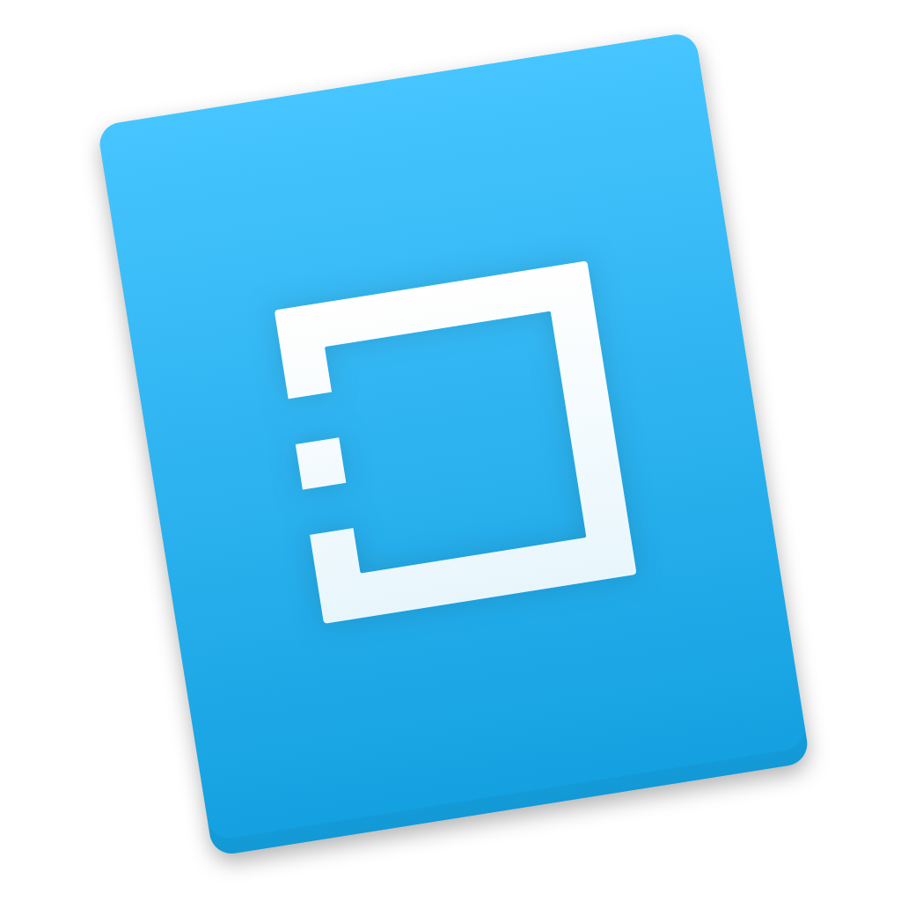
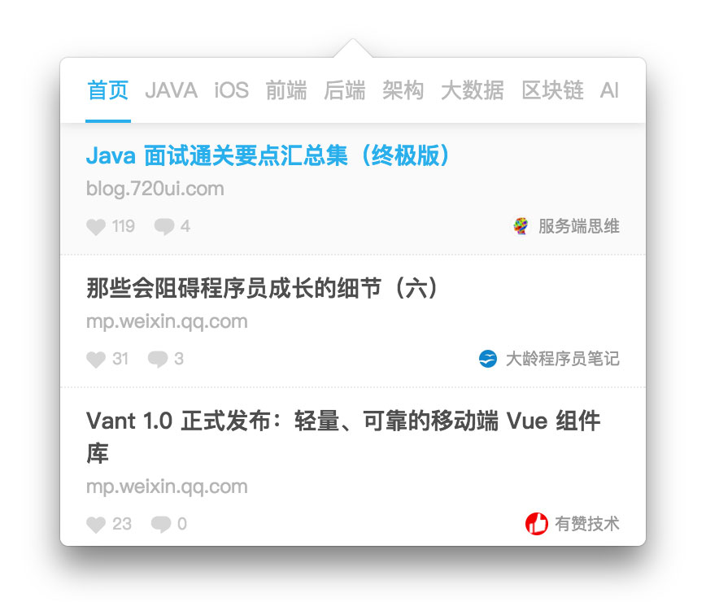

# Electron-TouTiao

开发者头条 Menubar application for Mac  
Rebound of [开发者头条Mac端插件](https://github.com/CM-Studio/TouTiao) by [tesths](https://github.com/tesths)

## Description

无意间发现工作室组里有个空repo  
就花了点时间把坑填上  

参照巨总插件的逻辑  
还是跳转默认浏览器打开  
~~尽管electron就是个浏览器~~  

主要还是设计工作   
纠结半天也不知道怎么做好看  
就先这样吧  
自己开发的时候好想上天能赐一人帮我设计  

## Feature

- 官网那些栏目
- 滚动加载分页
- 不支持登录点赞评论收藏

## Usage

```
$ npm install
$ npm start
$ npm run package
```

## Preview



## Reference

- [CM-Studio/TouTiao](https://github.com/CM-Studio/TouTiao)
- [xiangsudian/CaoMei](https://github.com/xiangsudian/caomei)

## License

MIT

